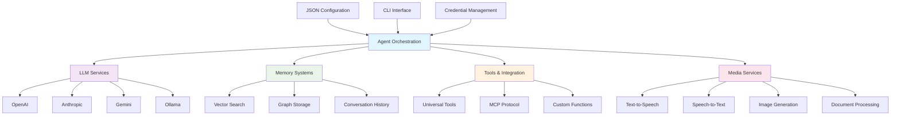

# 🧱 AI Lego Bricks

> 🏠 **Home** | 📖 [Documentation](#-core-components) | 🚀 [Getting Started](#-quick-start-5-minutes) | 🎯 [Learning Paths](#-learning-paths)

A modular library of building blocks for LLM agentic work, designed to be combined and configured like building blocks.

## 🎯 What & Why

**AI Lego Bricks** transforms complex AI workflows into simple, reusable components. Instead of writing custom code for every AI application, you combine pre-built services through JSON configuration.

### Key Benefits
- **🔧 Universal Tool Integration** - Register tools once, use with any LLM provider (OpenAI, Anthropic, Gemini, Ollama)
- **🤖 JSON-Driven Agents** - Create sophisticated AI workflows through configuration, not code
- **🔐 Production-Ready Security** - Built-in credential management and secure API handling

## 🧭 Navigation

| Section | Description | What you'll find |
|---------|-------------|------------------|
| [⚡ Quick Start](#-quick-start-5-minutes) | Get running in 5 minutes | Installation, first agent, verification |
| [🤔 "I want to..." Navigator](#-i-want-to-navigator) | Goal-based guidance | Common patterns, quick examples |
| [🧩 Core Components](#-core-components) | Service documentation | All building blocks, compatibility matrix |
| [🎓 Learning Paths](#-learning-paths) | Structured tutorials | Beginner → Intermediate → Advanced |
| [📚 Examples](#-examples-gallery) | Working examples | Runnable code, categorized use cases |
| [🛠️ CLI Reference](#-cli-reference) | Command-line tools | ailego commands, project templates |

## ⚡ Quick Start (5 minutes)

### Install

**Option 1: Automated Setup (Recommended)**
```bash
git clone https://github.com/callmebeachy/ai-lego-bricks.git
cd ai-lego-bricks

# Quick setup script - handles pip upgrade and dependency management
./setup_ai_lego_bricks.sh minimal    # Minimal install
./setup_ai_lego_bricks.sh ollama     # For local Ollama models
./setup_ai_lego_bricks.sh openai     # For OpenAI only
./setup_ai_lego_bricks.sh all        # Full installation
```

**Option 2: Manual Setup**
```bash
git clone https://github.com/callmebeachy/ai-lego-bricks.git
cd ai-lego-bricks

# Upgrade pip first (prevents editable install issues)
pip install --upgrade pip

# Lightweight install with just core dependencies
pip install -e ".[minimal]"
```

**Option 3: Provider-Specific Install**
```bash
# For Ollama (local models, no API keys needed)
pip install -e ".[ollama]"

# For OpenAI only
pip install -e ".[openai]"

# For Google Gemini only  
pip install -e ".[gemini]"

# For all LLM providers
pip install -e ".[llm]"
```

**Option 4: Full Install (All Features)**
```bash
# Complete installation with all optional dependencies
pip install -e ".[all]"
```

### Setup Environment
```bash
# Copy environment template
cp .env.example .env

# Edit .env with your API keys
# For Ollama: Set OLLAMA_URL=http://localhost:11434
# For others: Add respective API keys (see .env.example for guidance)
```

### Run Your First Agent
```bash
# Run a simple chat agent
ailego run agent_orchestration/examples/basic_chat_agent.json
```

### Verify Setup
```bash
ailego verify
```

### 🔧 Installation Troubleshooting

**Editable install fails with older pip:**
```bash
# Fix: Upgrade pip first
pip install --upgrade pip
pip install -e ".[minimal]"
```

**Too many dependencies installing:**
```bash
# Fix: Use provider-specific installs
pip install -e ".[ollama]"    # Minimal dependencies
pip install -e ".[openai]"    # Only OpenAI dependencies
```

**Missing API key warnings on import:**
```bash
# Fix: Set up only what you need in .env
# For Ollama: Just set OLLAMA_URL=http://localhost:11434
# See .env.example for complete guidance
```

**✅ That's it!** You now have a working AI agent system. 

### 🚀 Recent Improvements & Reliability

**All agent examples are tested and working** (January 2025):
- ✅ **9 Working Examples**: Complete end-to-end functionality verified
- 🔧 **Enhanced Infrastructure**: Fixed parallel processing, vision analysis, and data flow issues
- 🛡️ **Robust Error Handling**: Better validation and error propagation throughout the system
- 🔍 **Debug Tools**: Comprehensive debugging script with step-by-step execution details

**Test any example instantly:**
```bash
python examples/run_agent_debug.py agent_orchestration/examples/basic_chat_agent.json --input "Hello!"
```

**Ready for more?** → [Complete Setup Guide](setup/README.md) | [Build Your First Custom Agent](agent_orchestration/README.md)

## 🤔 "I want to..." Navigator

**Get started quickly based on your goal:**

| I want to... | What you need | Quick example |
|-------------|---------------|---------------|
| **Build a chatbot** | LLM + Chat services | `ailego run agent_orchestration/examples/basic_chat_agent.json` |
| **Process documents** | PDF + Memory + Agent | `ailego run agent_orchestration/examples/graph_memory_agent.json` |
| **Create a voice assistant** | STT + TTS + LLM | → [Voice Assistant Guide](agent_orchestration/examples/voice_assistant_agent.json) |
| **Analyze images** | Vision + Agent | → [Multi-Modal Processing](agent_orchestration/examples/) |
| **Build custom tools** | Universal Tool Service | → [Tool Creation Guide](tools/README.md) |
| **Add memory to agents** | Memory + Vector search | → [Memory Integration](memory/README.md) |
| **Use multiple LLMs** | LLM factory + providers | → [LLM Services](llm/README.md) |
| **Deploy to production** | Credential management | → [Production Setup](setup/README.md) |

### 🎯 **Common Patterns**
- **Document Q&A**: `PDF → Text Extraction → Memory Storage → Question Answering`
- **Voice Assistant**: `Speech → Text → LLM Processing → Text → Speech`
- **Multi-Modal Agent**: `Image + Text Input → Vision Analysis → Structured Output`
- **Research Agent**: `Multiple Documents → Concept Extraction → Synthesis → Report`

## 🧩 Core Components

### 🤖 **Intelligence & Workflows**
- **[Agent Orchestration](agent_orchestration/README.md)** - ✅ **Fully Tested** JSON-driven workflows with 9 working examples including parallel processing, vision analysis, and multi-modal support
- **[LLM Services](llm/README.md)** - Unified interface for OpenAI, Anthropic, Gemini, Ollama with streaming support
- **[Memory Systems](memory/README.md)** - Vector similarity search with Neo4j/Supabase backends for persistent knowledge
- **[Prompt Management](prompt/README.md)** - Versioned prompts with A/B testing and concept-based evaluation

### 🔧 **Tools & Integration**
- **[Universal Tools](tools/README.md)** - Register tools once, use with any LLM provider + MCP protocol support
- **[Credential Management](credentials/README.md)** - Secure API key handling with environment isolation
- **[Visual Content Processing](pdf_to_text/README.md)** - Extract text from PDFs/images with bounding box coordinates

### 🎨 **Media & Communication**
- **[Text-to-Speech](tts/README.md)** - OpenAI, Google, Coqui-XTTS with streaming LLM→TTS pipelines
- **[Speech-to-Text](stt/README.md)** - Faster Whisper, Google Speech with timestamps and speaker detection
- **[Image Generation](image_generation/README.md)** - DALL-E, Imagen, Stability AI with batch processing

### 📊 **Processing & Utilities**
- **[Text Chunking](chunking/README.md)** - Semantic text splitting for embeddings and memory storage
- **[Chat Services](chat/README.md)** - Stateful conversations with full history and export capabilities

### 🏗️ **System Architecture**



### 🏗️ **Compatibility Matrix**
| Service | OpenAI | Anthropic | Gemini | Ollama | Local |
|---------|---------|-----------|---------|---------|-------|
| **Text Generation** | ✅ | ✅ | ✅ | ✅ | - |
| **Vision** | ✅ | ✅ | ✅ | ✅ | - |
| **Tool Calling** | ✅ | ✅ | ✅ | ✅ | - |
| **Streaming** | ✅ | ✅ | Simulated | ✅ | - |
| **Text-to-Speech** | ✅ | - | ✅ | - | ✅ |
| **Speech-to-Text** | - | - | ✅ | - | ✅ |

## 🚀 Ready for More?

### 📚 **Deep Dive Documentation**
- **[Complete Setup Guide](setup/README.md)** - Supabase, Ollama, API keys, and production configuration
- **[Agent Orchestration](agent_orchestration/README.md)** - Build sophisticated workflows with JSON configuration
- **[Universal Tools](tools/README.md)** - Create custom tools and integrate external APIs
- **[Examples Gallery](examples/README.md)** - Runnable examples for common use cases

### 🎓 **Learning Paths**

#### 🟢 **Beginner Path** (2-3 hours)
1. **🚀 [Quick Start](#-quick-start-5-minutes)** - Install and run first agent
2. **💬 [Basic Chat Agent](agent_orchestration/examples/basic_chat_agent.json)** - Build your first conversational AI
3. **🧠 [Adding Memory](memory/README.md)** - Give your agent persistent knowledge
4. **🔧 [CLI Basics](setup/README.md)** - Master the ailego command-line tools

#### 🟡 **Intermediate Path** (4-6 hours)
1. **📄 [Document Processing](agent_orchestration/examples/graph_memory_agent.json)** - Extract and analyze text from PDFs
2. **🛠️ [Custom Tools](tools/README.md)** - Build specialized functions for your agents
3. **🎭 [Multi-Modal Workflows](agent_orchestration/examples/gemini_ollama_parallel_agent.json)** - Combine text, images, and audio
4. **🔗 [Service Integration](agent_orchestration/README.md)** - Connect multiple AI services

#### 🔴 **Advanced Path** (6-8 hours)
1. **🏭 [Production Setup](setup/README.md)** - Deploy AI agents to production
2. **🔌 [MCP Integration](tools/examples/README_MCP.md)** - Integrate Model Context Protocol servers
3. **🎼 [Custom Orchestration](agent_orchestration/examples/complex_workflow_agent.json)** - Build complex workflow patterns
4. **⚡ [Performance Optimization](agent_orchestration/examples/parallel_workflow_example.json)** - Scale and optimize your agents

### 🛠️ **CLI Reference**
```bash
ailego init my-project              # Create new project
ailego create chat --name "bot"     # Generate agent templates
ailego run workflow.json            # Execute workflows
ailego verify                       # Check setup
```

### 🤝 **Community & Contributing**
- **[GitHub Issues](https://github.com/callmebeachy/ai-lego-bricks/issues)** - Bug reports and feature requests
- **[GitHub Repository](https://github.com/callmebeachy/ai-lego-bricks)** - Source code and documentation

---

**🎯 Built with a learning-focused approach** - Each implementation helps you understand AI agent concepts while providing production-ready building blocks.